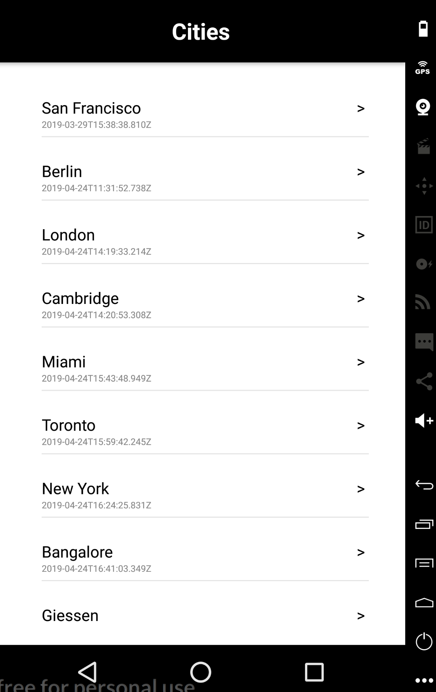
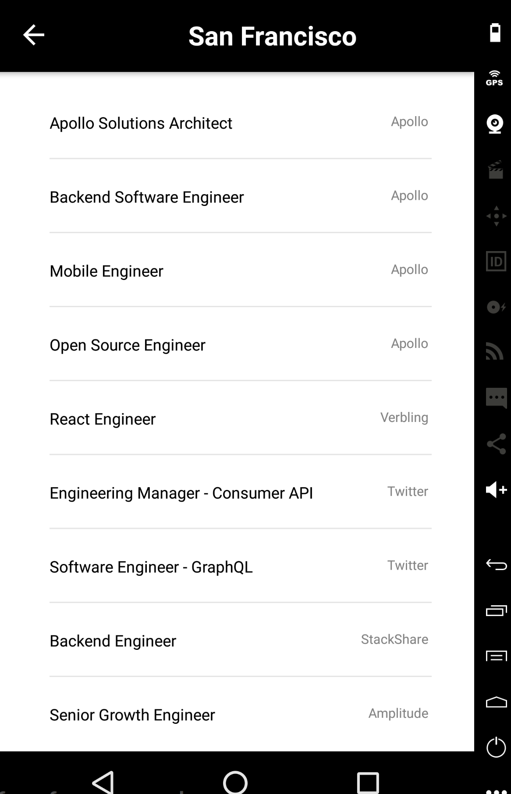
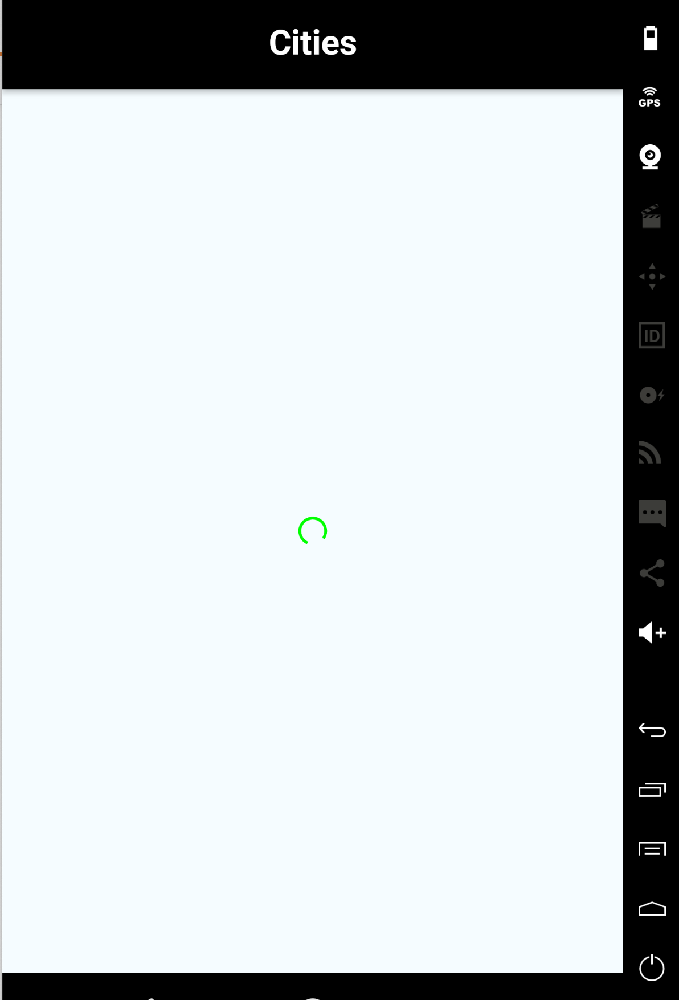

# Demo

This project shows a basic connection between graphql and react native

## Getting Started


### Prerequisites
  - Node v8.11.4
  - react-native-cli 2.0.1
  - XCode 9.4.1 
  - Android studio 3.1.4
  - genymotion 2.12.2

### Installing

```
yarn 
yarn start
react-native run-android
react-native run-ios
```

 ## Built With

* [react native](http://www.dropwizard.io/1.0.2/docs/) 
* [graphQl](https://api.graphql.jobs/) - Jobs
* [react navigation](https://reactnavigation.org/) v4

## Result Screens


* 



* 



## Authors

* **Kamaly Zapana**

## License

This project is licensed under the MIT License - see the [LICENSE.md](LICENSE.md) file for details
